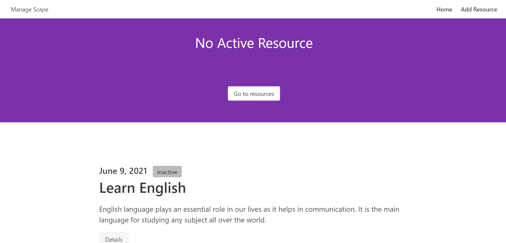

## Description
A basic resource management application using Next.js and Bulma. 

Add, activate and complete the resources within the time limit.

The resources can have three statuses:
* active - The current running resource
* inactive - Hasn't been activated yet
* complete - The resource has been succesfully completed

## Screenshots

Home Page

A single resource

Active resource

